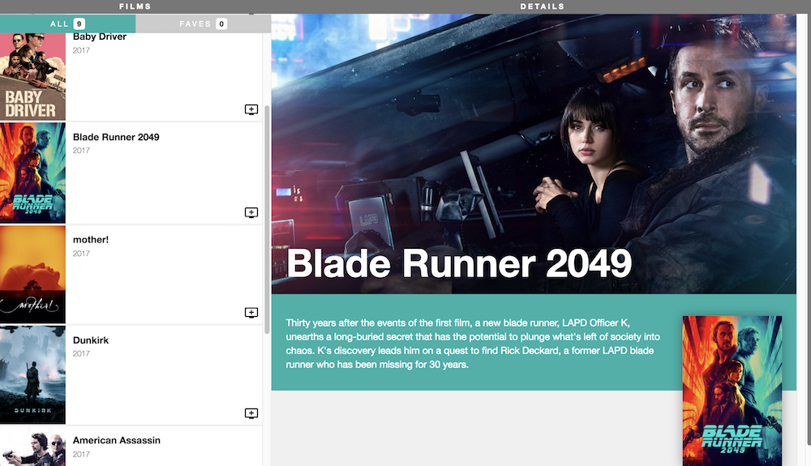

#  Starting a Film Project

This project was created with `create-react-app`. Once you have the app cloned, you should run `npm install`. You can then run it with `npm run start`.

## Your Mission

Today the plan is to identify the app components, create the overall structure, then split that structure into individual components. You'll pass films as props to each component and ultimately use iteration to render one component for each film. At the end of this exercise, you will have this app:



### Tasks

**Importantly**: After each step below, check your application to see how it looks before going to the next one. It's good practice to be sure your app is working correctly before adding new functionality.

<details>
  <summary>Hint</summary>
  Don't forget any <code>import</code> statements as you add more files.
</details>

#### Step 1: Create baseline layout

First, create the layout. You'll have a Films column and a Details column.

Make the provided `App` component render the following code:

```html
<div className="film-library">
  <div className="film-list">
    <h1 className="section-title">FILMS</h1>
  </div>

  <div className="film-details">
    <h1 className="section-title">DETAILS</h1>
  </div>
</div>
```

#### Step 2: Create new components

Move the `film-list` and `film-details` into their own separate components (in separate files), `FilmListing` and `FilmDetails`, respectively.

Make sure you now call these components in `App.js`. Check your app in the browser. If you've done it right, nothing will have changed, and the application will look the same.

#### Step 3: Pass props to the new components

Pass the films (stored in `TMDB.films`) to each of your new components as props.

If you check your file, it still shouldn't look differently. We're sending the props to the components, but we are not using the props yet.

<details>
  <summary>Hint</summary>
  For now, this step is just changing the <code>App.js</code> file to be sure it imports the film file and passes props.
</details>

#### Step 4: Render a film

In the `FilmListing` component, render the title of just 1 film as an `<h1>`, below the `section-title`.

Does "It" appear on the left side of your browser?

<details>
  <summary>Hint</summary>
  The films prop is an array, and you just want the title from the first one.
</details>


#### Step 5: Create and render an array of film title elements

Inside `render`, right above your `return` create a variable called `allFilms`

Inside of `allFilms` use `.map()` to iterate over the collection of films and create an element for each one. (Here is the [map documentation](https://developer.mozilla.org/en-US/docs/Web/JavaScript/Reference/Global_Objects/Array/map).

Then, render the variable `allFilms` underneath the Films `<h1>` (You can delete the `<h1>` you created from step 4.

You should have a list of all the films appear in the left column.

<details>
  <summary>Hint - Need help on <code>map</code>?</summary>
  This step will look like this in your <code>render</code> method (above the <code>return</code>):
  <code> let allFilms = this.props.films.map( film => ( your-jsx-per-film-here ))</code>
    Then, you'll just need to call <code>{allFilms}</code> in your JSX where you want the titles to appear.
</details>


#### Step 6: Move the film rows to their own component

Create a new component for each film row, called `FilmRow.js`. Have your `map` instead render your `FilmRow` component. Don't forget to pass the individual `film` prop to the component when creating them!

Don't forget to import your `FilmRow` component to `FilmList`

Once you have this working, also pass `film.id` as a `key` prop to `FilmRow`, though you won't use it yet.


#### Step 7: Flesh out each film row

Make each film row in the film list look like the main finished image, using the following markup (replace "TITLE" and "YEAR" with the actual title and year of the film).

```
<div className="film-row">
  

  <div className="film-summary">
    <h1>TITLE</h1>
    <p>YEAR</p>
  </div>
</div>
```

- You'll have to create the `posterUrl` for each film by combining the prefix `https://image.tmdb.org/t/p/w780/` with each film's `poster_path` property.

- You'll also have to extract the year from the `release_date` property. To do this, you'll need to figure out how to use the [`getFullYear()`](https://developer.mozilla.org/en-US/docs/Web/JavaScript/Reference/Global_Objects/Date/getFullYear) JS method.

<details>
  <summary>Hint on <code>getFullYear()</code></summary>
  <code>getFullYear()</code> will be a single line of new code, and you'll use the keywords <code>new</code> and <code>Date</code>.
</details>


#### Step 8: Move film posters to their own component

Since the poster requires you to create the URL first, move those elements to their own component. This could be reusable later. Don't forget to pass the film as a prop to the new `FilmPoster` component.
